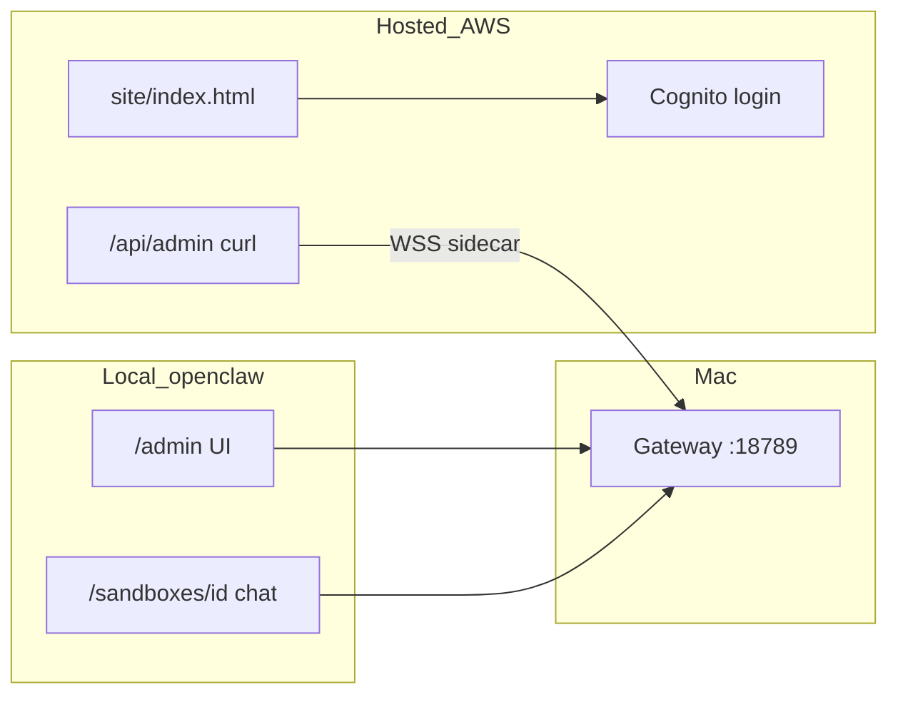

# OpenClaw ↔ sam-terraform hosting contract

Infra lives in `sam-terraform`. Read these, in order:

1. `sam-terraform/docs/openclaw.md` — every AWS component, how they connect, cost
2. `sam-terraform/docs/openclaw-integration.md` — table names, JWT vs WebSocket, routes
3. `sam-terraform/docs/openclaw-admin.md` — bootstrap admin, curl recipes, sidecar, local UI

**Do not** target ECS Fargate, RDS, Tailscale EC2, or a public Gateway.

## Local full console vs hosted edge

| Concern | This repo (`openclaw`) | `sam-terraform` |
|---|---|---|
| Full admin UI + chat UI | Yes — `apps/portal` (`npm run dev` → `/admin`, `/sandboxes/[id]`) | No — hosted `site/index.html` is Cognito login landing only |
| Auth | Cookie `halcyon_session` + DynamoDB password (local) | Cognito Hosted UI + JWT |
| Chat | `POST /api/sandboxes/:id/chat` SSE → loopback Gateway | WebSocket via AWS; REST chat returns **426** |
| Reach Gateway | Portal holds `OPENCLAW_GATEWAY_TOKEN`, calls `:18789` | **Sidecar only** holds Gateway token; Lambda never does |
| Provision agent | `scripts/provision-sandbox.mjs` on sandbox create | Sidecar `{ type: "provision" }` → `openclaw agents add` |
| Publish SPA | `.github/workflows/publish.yml` packages `site/index.html` | Pins `openclaw_spa_version`, serves CloudFront |
| Publish Lambda | — | `publish-openclaw.yml` → `openclaw_lambda_version` |

**UX today:** Staging `https://staging.halcyonlabs.uk` = signup + landing. Grant sandboxes with admin Cognito JWT + `/api/admin/*` (see admin runbook), or use local `/admin`. Ordinary signup → `client` with **zero** sandboxes until an admin attaches them.

## Hosted shape

Two isolated environments (separate Terraform state, VPC, IAM, Lambda, Cognito, Dynamo, artifacts bucket):

| | Production | Staging |
|---|---|---|
| App | `https://app.halcyonlabs.uk` | `https://staging.halcyonlabs.uk` |
| Login | `https://login.halcyonlabs.uk` | `https://login.staging.halcyonlabs.uk` |
| WebSocket | `wss://ws.app.halcyonlabs.uk` | `wss://ws.staging.halcyonlabs.uk` |
| Dynamo prefix | `halcyon_` | `halcyon_staging_` |
| Apply | `cd sam-terraform/envs/production` | `cd sam-terraform/envs/staging` |
| GitHub | Environment `production` (`master`/`main`) | Environment `staging` (openclaw branch `staging`; terraform stays on `main` + `envs/staging`) |

- Cognito groups `admin` | `client` (separate user pools)
- `userId` = Cognito `sub`. Hosted users have no `passwordHash`
- Chat on AWS is WebSocket, not `POST /api/sandboxes/:id/chat` (that returns 426)
- Sidecar is the only caller of `http://127.0.0.1:18789`. `OPENCLAW_ENV=prod|staging`
- Staging publish cannot `lambda:UpdateFunction*` on prod

Prod flag: `deploy_openclaw = false` in `envs/production/production.tfvars` until explicitly applied. Requires `deploy_ses = true`. Staging has no flag.

## Artifacts

| Artifact | Publisher | Pin file |
|---|---|---|
| Hosted SPA `site/index.html` | this repo `.github/workflows/publish.yml` | `openclaw_spa_version` in that env’s tfvars |
| Lambda zip | `sam-terraform` `.github/workflows/publish-openclaw.yml` | `openclaw_lambda_version` |

**Staging SPA pin PR:** After a successful upload to the staging artifacts bucket, Publish opens or updates PR branch `bots/openclaw-spa-pin` → base `main` on `samoclay/sam-terraform`, setting `openclaw_spa_version` in `envs/staging/staging.tfvars` only (staging vs prod is the `envs/` folder, not a git branch). Merge that PR to apply staging. Requires repo secret `SAM_TERRAFORM_TOKEN` (fine-grained PAT: contents + pull requests on `samoclay/sam-terraform`). Production pins stay manual in `production.tfvars`.

Next.js `apps/portal` is local-only. Empty version strings mean terraform packages from its own `functions/` tree (first apply). After apply, set GitHub Environment **Variables** from that env’s `terraform output openclaw_github_actions` (`AWS_ROLE_ARN`, `ARTIFACTS_BUCKET`) — never copy the prod role onto the staging environment.
